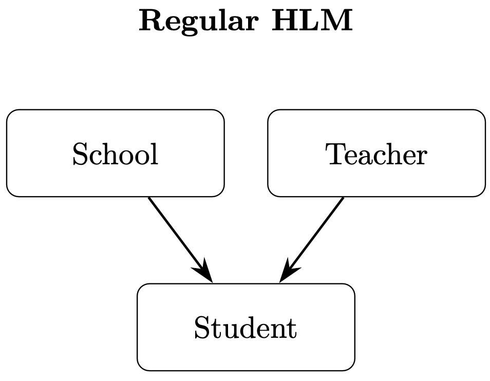
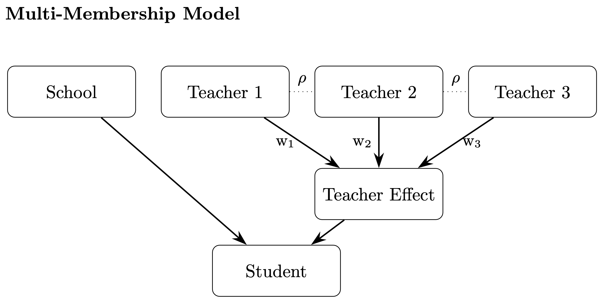

```{r}
#| label: setup
#| include: false
#| message: false


knitr::opts_chunk$set(
  fig.width = 6,
  fig.height = 6 * 0.618,
  fig.retina = 3,
  dev = "ragg_png",
  fig.align = "center",
  collapse = TRUE,
  out.width = "95%",
  warning = FALSE,
  cache.extra = 12345  # Change number to invalidate cache
)

options(
  digits = 4,
  width = 300
)

set.seed(12345)
```

::: {.callout-note}
This tutorial assumes that you are familiar with R, hierarchical linear models (HLM), Bayesian models, and the basic syntax of `brms`. 
:::

We will be using these packages in this tutorial:

```{r}
#| label: libraries
#| include: true
#| message: false
library(tidyverse)         # ggplot, dplyr, %>%, and friends
library(gt)                # for displaying tables
library(DT)                # for interactive tables
library(clusterGeneration) # for simulating data
library(MASS)              # for simulating data
library(brms)              # for Bayesian models
library(tidybayes)         # for extracting model parameters
library(marginaleffects)   # for model marginal effects
library(corpcor)           # calculating covariance matrix


# Custom ggplot theme to make pretty plots
# Get the News Cycle font at https://fonts.google.com/specimen/News+Cycle
theme_clean <- function() {
  theme_minimal(base_family = "News Cycle") +
    theme(panel.grid.minor = element_blank(),
          plot.title = element_text(face = "bold"),
          axis.title = element_text(face = "bold"),
          strip.text = element_text(face = "bold", size = rel(1), hjust = 0),
          strip.background = element_rect(fill = "grey80", color = NA),
          legend.title = element_text(face = "bold"))
}

```


# Introduction


We'll start this tutorial with an example scenario. Imagine a school district wants to examine the efficacy of a new after-school intervention program it wants to implement. This new program is fairly intensive and requires 3 teachers to implement properly, since the new program covers multiple subject areas. This new program also uses some sort of fancy algorithm that caters the amount of time that each student spends with each of the three teachers based on the student's needs. That means that each student spends a different percentage of time with each of their three assigned teachers.

To study the efficacy of the program, the district picks half of their teachers to be trained in the program (the intervention group), while the other half continue business as usual (the comparison group) [regular after-school tutoring]. For simplicity, the teachers are assigned to students across the district and might have students at multiple schools.

The district also requires teachers within each group to work with each other in smaller professional learning communities (PLCs) to continue to enhance the quality of their instructional practices. The teachers get to choose who they work with in PLCs, as long as they are within the same treatment or comparison group. The size of PLCs can vary, and teachers can switch between PLCs throughout the course of the study.

Half of the identified students for the study are assigned to the intervention group and the other half to the comparison group. Each student is assigned 3 teachers from their assigned group.

As part of the study, the district collected pre- and post-test scores, a variety of student demographic information, which teachers were assigned to each student, how much time each student spent with each teacher, and how often each teacher worked with each of the other teachers in their group.

This scenario is not uncommon in the education world, where students, depending on grade level, often have multiple teachers throughout the course of the year or when a district implements a new education platform that has multiple components (such as separate math, English language arts, and science components), and it wants to compare the effect of that combination of products to business as usual.

How do we model these data appropriately to examine the efficacy of the new program?

The traditional way to approach this would be through regular hierarchical linear modeling (HLM). We would create a model where we cluster the students by school and teacher by adding a random intercept for school and teacher, or if teachers are limited to one school, we could nest teachers within schools. We can visualize this (unnested) relationship like this:

 

The regular HLM model assumes that each student only has one school and one teacher. So how would we incorporate multiple teachers? We could add additional random intercepts for each of the three teachers the student could have. However, this assumes that each of the three teachers had independent contributions to the student. That means that it doesn't account for the differing amount of time each student spent with the teacher. The order of the teachers also matters if we construct the model this way. For example, if teacher A is listed in the teacher 1 position for one student, but the teacher 2 position for another student, the model will treat the contributions of teacher A in the teacher 1 position independently of their contributions to the teacher 2 and teacher 3 positions. Since the teacher 1, 2, and 3 positions are arbitrary distinctions, we don't want three separate independent measures of each teacher's contribution. So how do we overcome this? Enter multi-membership models.

Multi-membership models are a way of allowing an observation to have multiple group memberships, as the name indicates. How this works is that each of the possible groups (in our case, teachers) contributes a portion of the overall group effect. That portion is determined by assigning weights to each group for each observation. The groups can also be correlated with each other, so that each group can also influence the others. The combined effect that takes into account the inter-teacher correlation and the weighted contributions of each individual teacher becomes the overall teacher effect. When modeled this way, the ordering of the teachers as teacher 1, 2, or 3 doesn't matter, as long as they have appropriate weights for each observation.

The multi-membership model is visualized in the image below, where each teacher is correlated with each other, indicated by $\rho$, and each teacher contributes a portion of the teacher effect based on their weight, $w_i$.



In our example scenario, the multi-membership model allows us to account for the weighted contributions of each teacher, as well as the correlations between teachers.


# Simulating Data


Before we can see a multi-membership model in action, we need to simulate some data.  
We want data that are similar to the example scenario above. Namely, we want:

- Student-level data that includes:
  - A continuous outcome variable
  - Common student demographic variables
  - Baseline performance data
  - School attended
  - Three assigned teachers and weights for each
  - Group assignment (the treatment group or the business-as-usual comparison group)
- School-level effects
- Teacher effects:
  - A weighted combination of each teacher's individual effects
  - A covariance matrix based on the correlation of each teacher

In addition, we assume that teachers are not nested in schools, so teachers can be at multiple schools, but we assume that teachers can only be part of the treatment or comparison group, not both.

Since it is a fairly detailed process to simulate these data, I wrote a function to help automate this.

The steps that we take to simulate the data are:

1. Generate a teacher covariance matrix that describes how each teacher influences the other teachers. This is done to simulate teachers working together in PLCs.
2. Simulate school random intercepts to model school-level effects.
3. Simulate teacher-level effects.
4. Generate student-level covariates.
5. Assign students to teachers and create weights to simulate the proportion of time each student spent with each of their three teachers.
6. Create teacher effects for each student using information from steps 1, 3, and 5.
7. Calculate the final outcome scores using all the previously generated data.
8. Combine all the data together and export a list that contains two data frames:
   - `student_data`: All the student-level data including weights for each teacher.
   - `teacher_cov`: The teacher covariance matrix.


```{r}
#| echo: true
simulate_multimember_hlm_combined <- function(
    # ==== INPUT PARAMETERS ====
    n_students = 1000,         # Total number of student records to simulate.
    n_schools = 50,            # Number of distinct schools; students will be randomly assigned to these.
    teachers_per_student = 3,  # How many teachers each student is assigned.
    n_teachers = 50,           # Number of teachers in each of two groups (treatment and control). Total teachers is this value * 2.
    alphad = 1,                # Concentration parameter for generating random correlation matrices:
                               #    When =1, produces a uniform draw.
                               #    >1 shrinks correlations toward 0.
                               #    <1 pushes correlations toward ±1.
    cross_group_corr = 0,      # If nonzero, imposes this constant correlation between
                               # treatment-group teachers and control-group teachers.
    fixed_intercept = 0,       # The grand mean intercept in the outcome equation.
    beta_group = 0.6,          # Effect size for being in the “Treatment” vs. “Control” group.
    beta_gender = 0.02,        # Effect per unit of coded gender.
    beta_EL = -0.05,           # Effect of being an English Learner (“Yes” vs. “No”).
    beta_SES = 0.1,            # Effect of having High vs. Low socioeconomic status.
    beta_prior = 0.2,          # Effect of prior achievement (a continuous z-score variable).
    beta_student_cont = 0.2,   # Effect of a generic student-level continuous covariate.
    beta_student_bin = -0.1,   # Effect of a generic binary student-level covariate.
    beta_teacher_cov = 0.3,    # Weight on each teacher’s continuous characteristic when computing outcome.
    student_error_sd = 0.3,    # Standard deviation of the residual (unexplained) student-level noise.
    sigma_school = 0.1         # Standard deviation of the normally distributed school random intercepts.
) {
  # —————————————————————————————————————————————————————————————
  # Ensure the required packages are available for matrix generation and multivariate draws.
  if (!requireNamespace("clusterGeneration", quietly = TRUE)) stop("'clusterGeneration' needed")
  if (!requireNamespace("MASS", quietly = TRUE))            stop("'MASS' needed")
  
  # Shortcut for readability below: number of teachers per student
  p <- teachers_per_student
  
  # 1) BUILD FULL TEACHER COVARIANCE MATRIX
  # -------------------------------------------------------------
  # We will generate a (2*n_teachers) × (2*n_teachers) correlation
  # matrix, divided into two blocks (treatment vs control), optionally
  # linked by cross-group correlations.
  
  # Generate unique IDs for treatment and control teachers
  treat_names   <- paste0('T', seq_len(n_teachers))  # “T1”, “T2”, …, “T50”
  control_names <- paste0('C', seq_len(n_teachers))  # “C1”, “C2”, …, “C50”
  col_names     <- c(treat_names, control_names)
  
  # Draw two independent random correlation matrices (size n_teachers × n_teachers)
  # using concentration parameter alphad.
  R_treat   <- clusterGeneration::rcorrmatrix(n_teachers, alphad = alphad)
  R_control <- clusterGeneration::rcorrmatrix(n_teachers, alphad = alphad)
  
  # Initialize a big zero matrix, then insert our two blocks
  teacherCov <- matrix(0, 2*n_teachers, 2*n_teachers)
  teacherCov[1:n_teachers, 1:n_teachers] <- R_treat
  teacherCov[(n_teachers+1):(2*n_teachers),
             (n_teachers+1):(2*n_teachers)] <- R_control
  
  # If the user asked for cross-group correlation, fill in the off-diagonal blocks
  if (cross_group_corr != 0) {
    cross_block <- matrix(cross_group_corr, n_teachers, n_teachers)
    teacherCov[1:n_teachers, (n_teachers+1):(2*n_teachers)] <- cross_block
    teacherCov[(n_teachers+1):(2*n_teachers), 1:n_teachers] <- cross_block
  }
  
  # Label rows and columns so we can subset by teacherID later
  dimnames(teacherCov) <- list(col_names, col_names)
  
  # 2) SIMULATE SCHOOL INTERCEPTS
  # -------------------------------------------------------------
  # Each school gets its own random intercept drawn from N(0, sigma_school^2).
  school_ints <- rnorm(n_schools, mean = 0, sd = sigma_school)
  
  # 3) SIMULATE TEACHER-LEVEL PARAMETERS
  # -------------------------------------------------------------
  # Each teacher has two characteristics:
  #    t_int : a teacher-specific intercept
  #    t_cov : a continuous covariate
  # We draw these as bivariate normals with a 2×2 covariance built via rcorrmatrix.
  
  corr2 <- clusterGeneration::rcorrmatrix(2, alphad = alphad)
  sds   <- c(1, 2)          # Standard deviations for [t_int, t_cov]
  means <- c(0, 5)          # Means for [t_int, t_cov]
  cov2  <- diag(sds) %*% corr2 %*% diag(sds)  # Scale partial‐corr to actual cov
  
  # Draw 2*n_teachers independent bivariate normals, then split into t_int/t_cov
  teacher_data <- data.frame(
    teacherID = factor(col_names, levels = col_names),
    group     = rep(c("Treatment", "Control"), each = n_teachers),
    t_int     = MASS::mvrnorm(2*n_teachers, mu = means, Sigma = cov2)[,1],
    t_cov     = MASS::mvrnorm(2*n_teachers, mu = means, Sigma = cov2)[,2]
  )
  
  # 4) GENERATE STUDENT-LEVEL COVARIATES
  # -------------------------------------------------------------
  # For each student, randomly assign:
  #    school (1…n_schools)
  #    group  (0/1 treatment vs control)
  #    gender (Male/Female/Other)
  #    ethnicity (5 levels)
  #    SES    (High/Low)
  #    EL     (Yes/No)
  #    prior_z: a partial z-score based on SES and random noise
  #    student_cont: generic continuous covariate ~ N(0,1)
  #    student_bin : generic binary covariate ~ Bernoulli(0.5)
  
  school       <- sample(rep(1:n_schools, length.out = n_students))
  group        <- rbinom(n_students, 1, 0.5)
  gender       <- factor(sample(c('Male','Female','Other'),
                                n_students, replace = TRUE,
                                prob = c(0.45,0.45,0.10)))
  ethnicity    <- factor(sample(paste0('group', 1:5), n_students, TRUE))
  SES_bin      <- rbinom(n_students, 1, 0.5)
  SES          <- factor(ifelse(SES_bin == 1, 'High', 'Low'))
  EL           <- factor(ifelse(rbinom(n_students, 1, 0.1) == 1, 'Yes', 'No'))
  prior_z      <- as.numeric(0.5 * scale(SES_bin) + 0.5 * rnorm(n_students))
  student_cont <- rnorm(n_students)
  student_bin  <- rbinom(n_students, 1, 0.5)
  
  # 5) ASSIGN TEACHERS & WEIGHTS TO STUDENTS
  # -------------------------------------------------------------
  # Each student i:
  #    If in treatment group, selects p teacher IDs from treat_names; else control_names
  #    Generates p random weights via Exp(1), then normalizes them to sum to 1
  assign  <- matrix(NA_character_, n_students, p)
  weights <- matrix(NA_real_,       n_students, p)
  for (i in 1:n_students) {
    pool         <- if (group[i] == 1) treat_names else control_names
    assign[i, ]  <- sample(pool, p)
    w            <- rexp(p)
    weights[i, ] <- w / sum(w)
  }
  colnames(assign)  <- paste0("teacher", 1:p)
  colnames(weights) <- paste0("weight",  1:p)
  
  # 6) DRAW TEACHER EFFECTS FOR EACH STUDENT
  # -------------------------------------------------------------
  # For each student:
  #    Look up the p assigned teacher IDs → numeric positions
  #    Subset the big teacherCov to just those positions → a p×p Sigma
  #    Subset teacher_data$t_int to get a length-p mean vector
  #    Draw a multivariate normal of length p → eff[i, ]
  eff <- matrix(NA_real_, n_students, p)
  for (i in 1:n_students) {
    teacher_ids <- match(assign[i, ], teacher_data$teacherID)
    mean_vec    <- teacher_data$t_int[teacher_ids]
    cov_sub     <- teacherCov[teacher_ids, teacher_ids]
    eff[i, ]    <- MASS::mvrnorm(1, mu = mean_vec, Sigma = cov_sub)
  }
  
  # 7) COMPUTE FINAL OUTCOME FOR EACH STUDENT
  # -------------------------------------------------------------
  # Components:
  #    fixed_intercept
  #    beta_group * group
  #    beta_gender * (gender code)
  #    beta_EL     * EL flag
  #    beta_SES    * SES flag
  #    beta_prior  * prior_z
  #    beta_student_cont * student_cont
  #    beta_student_bin  * student_bin
  #    beta_ethnicity    * ethnicity effect
  #    mean of teacher intercepts (mean_eff)
  #    weighted teacher covariate effect (weighted_cov)
  #    school random intercept
  #    student noise ~ N(0, student_error_sd^2)
  
  beta_eth     <- setNames(c(-1, -0.5, 0, 0.5, 1), levels(ethnicity))
  mean_eff     <- rowMeans(eff)
  weighted_cov <- rowSums(
    weights *
      teacher_data$t_cov[match(assign, teacher_data$teacherID)] *
      beta_teacher_cov
  )
  
  outcome <- fixed_intercept +
    beta_group        * group +
    beta_gender       * (as.numeric(gender) - 1) +
    beta_EL           * (EL == "Yes") +
    beta_SES          * (SES == "High") +
    beta_prior        * prior_z +
    beta_student_cont * student_cont +
    beta_student_bin  * student_bin +
    beta_eth[ethnicity] +
    mean_eff +
    weighted_cov +
    school_ints[school] +
    rnorm(n_students, mean = 0, sd = student_error_sd)
  
  # 8) ASSEMBLE AND RETURN FINAL DATA
  # -------------------------------------------------------------
  # Create a data.frame of all student covariates and the outcome,
  # plus return the underlying teacher covariance matrix.
  student_data <- data.frame(
    studentID = 1:n_students,
    school    = factor(school),
    treatment     = factor(ifelse(group == 1, "Treatment", "Control")),
    gender,
    ethnicity,
    SES,
    EL,
    prior_z,
    student_cont,
    student_bin,
    weights,
    assign,
    outcome
  )
  
  list(
    student_data = student_data,  # student-level dataset ready for analysis
    teacher_cov  = teacherCov      # full teacher covariance matrix 
  )
}
```

We will now use the function we created to simulate data for 1,000 students in 50 schools with 100 teachers (50 teachers in the comparison and 50 in treatment group).

```{r}
#| echo: true
#| cache: true

simulated_data_list <- simulate_multimember_hlm_combined()
# separate the list into separate data frames
student_data <- simulated_data_list$student_data
teacher_cov <- simulated_data_list$teacher_cov

head(student_data) %>% datatable()
head(teacher_cov) %>% datatable()

```

# Building a Multi-Membership Model with brms

## brms Syntax  for Multi-Membership Models
The `brms` syntax for multi-membership models is very similar to that of regular HLM. We code the multi-membership random intercept using the `mm()` function inside the regular random intercept syntax. In our example, we include the three teachers like this `(1 | mm(teacher1, teacher2, teacher3))`. However, that as is tells the model that the teacher random intercept is the result of an equal contribution of the three teachers. We don't want an equal contribution, but one equal to the proportion of time each teacher spent with the student, so we need to add a `weights` argument. This argument expects the same number of columns as there are multi-membership groups, so we include the three weights columns using `cbind()` like this: `(1 | mm(teacher1, teacher2, teacher3, weights = cbind(weight1, weight2, weight3)))`. In this example, `weight1` is the weights for teacher1, `weight2` for teacher2, and `weight3` for teacher3. By default, `brms` scales the weights so that they sum to 1, which you can disable with `scale = FALSE` as needed.

Since the teachers were only either part of the treatment group or the comparison group, we can use the `by` argument to model the teacher effects separately by treatment group. This tells the model to calculate separate teacher effects for each group, since we expect that there may be variation in the teacher effect between groups, especially since the treatment group is all using the same new program, while the comparison group might be using multiple different programs or strategies. Like the `weights` argument, `by` expects columns equal to the number of groups. Since the student only had teachers of the same group, just repeat the group column three times like this `by = cbind(group, group, group)`. However, if a student could have teacher1 from the comparison group and teacher2 and teacher3 from the treatment group, separate grouping variables for each teacher could be used. This still assumes that each teacher could only be in the treatment or comparison group, but that students could have a combination of teacher types.

Right now, the model assumes that the effect of each of the three teachers is independent of each other. However, we know that the teachers work closely with each other and, therefore, that their teaching effect is correlated with those they worked closely with. To model this, we add a pre-computed covariance matrix using the `cov` argument. In our example, we'll use `cov = teacher_cov`. Since the covariance matrix is not part of the data frame for the rest of the data, we need to use the `data2` argument to specify which object to use like this: `data2 = list(teacher_cov = teacher_cov)`.

| Multi-Membership Argument | Purpose                                                                                                             |
|-----------------------------|---------------------------------------------------------------------------------------------------------------------|
| weights                     | Specify the weight each group member contributes to the overall group   effect.                                     |
| scale                       | Whether to scale the weights to sum to 1.                                                                           |
| by                          | Specify whether to calculate separate group effects by a sub-population   group.                                    |
| cov                         | To include a covariance matrix that specifies how each group member is   associated/related with each other member. |


We won't cover it in this tutorial, but one can also include random slopes for each of the `mm()` groups using the `mmc()` function.^[We also won't cover multivariate models, but the regular multivariate syntax for brms also applied to `mm()`. That means that we could model 3 different outcome test scores (such as math, science, and reading), while correlating the multi-membership teacher effect between outcomes.] For example, if each teacher supported both the treatment and comparison groups, we could create variables called group1, group2, and group3 that indicate the group each teacher was in for a given student. We could then add that as a random slope like this: `(1 + mmc(group1, group2, group3) | mm(teacher1, teacher2, teacher3))`. Since teachers now have multiple groups, we could not use the `by` argument for `mm()` with those same variables, since `by` assumes that each teacher only has one group.^[However, if the random slopes are some other variable, like perhaps school type (such as private or public), if the program included public and private schools, and teachers were only assigned to either the treatment or comparison group, then we could use both random slopes and the `by` argument.]

## The Model

Now let's put it all together and run our first model.

```{r}
#| echo: true
#| cache: true
#| message: false
# Set priors for the betas
model_priors <- prior(normal(0,1),class="b")

# run model
model_cov <- brm(
  bf(
    outcome ~ treatment + gender + ethnicity + SES + EL + prior_z +
      (1 | school) + (
        1 | mm(
          teacher1,
          teacher2,
          teacher3,
          by = cbind(treatment, treatment, treatment), # group by treatment vs comparison
          weights = cbind(weight1, weight2, weight3),# weights for each teacher
          cov = teacher_cov # teacher covariance matrix
        )
      )
  ),
  data = student_data,
  data2 = list(teacher_cov = teacher_cov), # tell the model where to find the teacher covariance matrix
  family = gaussian(),
  prior = model_priors,
  cores = 4,
  chains = 4
)

```

In the model's summary, we can see there are two standard deviation estimates for the teacher random intercept, one for each treatment group. 

```{r}
#| echo: true
#| cache: true
#| message: false

summary(model_cov)
```

Even though the model examines the combined effect of the student's three teachers, we can still extract the random intercept for each individual teacher.

```{r}
#| echo: true
#| cache: true
#| message: false
teacher_effects <- summarise_draws(model_cov) %>%
  filter(grepl("r_mmteacher",variable)) %>%
  mutate(teacher = str_extract(variable,"C\\d+|T\\d+")) %>%
  mutate(treatment = case_when(
    grepl("C",teacher) ~ "Control",
    .default = "Treatment"
  )) %>%
  dplyr::select(variable,teacher,treatment, median, q5, q95)

teacher_effects %>%
  ggplot(aes(x = median, y = reorder(teacher,median))) +
  geom_point() +
  geom_errorbar(aes(xmin = q5, xmax = q95)) +
  facet_wrap(~treatment, scales = "free_y") +
  theme_clean() +
  theme(axis.text.y = element_text(size = 4)) +
  ylab("Teacher") +
  xlab("Median Effect")
```

We can also examine the effect of the program, just like regular HLM models by using the `marginaleffects` package.

```{r}
#| echo: true
#| cache: true
#| message: false
avg_predictions(model_cov,by = "treatment") %>%
  data.frame() %>%
  ggplot(aes(x = treatment, y = estimate)) +
  geom_point() +
  geom_errorbar(aes(ymin = conf.low, ymax = conf.high)) +
  theme_clean() +
  xlab("") +
  ylab("Estimated Average Outcome Score")
```

We can also test the hypothesis that the difference between the treatment and comparison group is greater than 0 by using `hypothesis()`.

```{r}
#| echo: true
#| cache: true
#| message: false
hyp <- hypothesis(model_cov, "treatmentTreatment > 0")

hyp$hypothesis %>%
  dplyr::select(-Evid.Ratio) %>%
  gt()

```

# Creating Your Own Covariance Matrix

In a real-world scenario, how can we calculate a covariance matrix to use in a multi-membership model? There are multiple ways to approach this, and in a real study, you should likely conduct sensitivity analyses to see how your results are affected by the covariance matrix and the various choices you made. For this tutorial, we will pick a relatively simple way.

If teachers in the study work or prep together, are members of the same PLC, or have some other documentable collaboration, we can create a matrix where we count either the number of those instances of collaboration or perhaps the hours of collaboration time, since each interaction could vary in time. In a more complex version, you could weight certain types of interactions more heavily than others.

For now, we just simulate a matrix that describes how many hours 20 teachers worked with each other.

```{r}
#| echo: true
#| message: false

n_teachers <- 20

prob_zero <- 0.7   # 70% chance of 0 (no collaboration with a given teacher)
max_hours <- 100  
hours_upper <- matrix(0, n_teachers, n_teachers)
hours_upper[upper.tri(hours_upper)] <- sample(
  0:max_hours,
  choose(n_teachers, 2),
  replace = TRUE,
  prob = c(prob_zero, rep((1 - prob_zero)/max_hours, max_hours)))


# Symmetrize
hours_mat <- hours_upper + t(hours_upper)

# Zero out the diagonal (no self‐hours)
diag(hours_mat) <- 0
```

Now that we have our collaboration matrix, we could create a covariance matrix using the `cov()` function, but that could create noisy or problematic values, especially if there are lots of 0s. Instead, we'll create a covariance matrix using the `cov.shrink()` function in the `corpcor` package that computes a shrinkage estimate of covariance. According to the package's documentation, the shrinkage estimates tend to be more efficient and have desirable attributes like being positive definite and well-conditioned, which makes them suitable for use in regression models. The shrinkage estimates do add a very small amount of bias to the estimate but greatly decrease the variance (noise).

```{r}
#| echo: true
#| message: false
cov_shrunk <- cov.shrink(hours_mat)
head(cov_shrunk) %>% datatable()
```

# Further Reading

For further reading on multi-membership models see:

- [https://michael-franke.github.io/Bayesian-Regression/practice-sheets/03c-multi-membership.html](https://michael-franke.github.io/Bayesian-Regression/practice-sheets/03c-multi-membership.html)
- See example 4 of this article: [https://arxiv.org/pdf/1705.11123](https://arxiv.org/pdf/1705.11123)
- Frequentist version using SAS: [https://prevention.nih.gov/education-training/methods-mind-gap/introduction-cross-classified-multiple-membership-and-dynamic-group-multilevel-models](https://prevention.nih.gov/education-training/methods-mind-gap/introduction-cross-classified-multiple-membership-and-dynamic-group-multilevel-models)