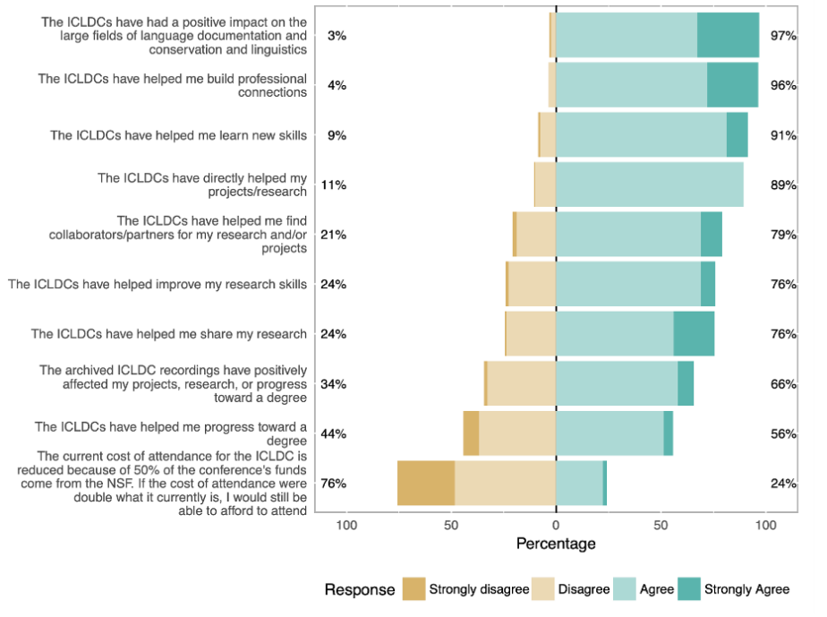

## Important links

- [Article](http://hdl.handle.net/10125/24966)


## Abstract

The International Conference on Language Documentation & Conservation series, or ICLDC, has, since its inception in 2009, become the flagship conference for the field of language documentation. Every two years, conference attendees gather at the University of Hawai‘i at Mānoa to share their experiences working on diverse topics related to the preservation of underrepresented languages worldwide. Attendees come from a range of backgrounds: Indigenous language communities, language activism organizations, K–12 school systems, as well as students and faculty from colleges and universities. They represent dozens of countries and hundreds of languages, and they have one goal in mind: supporting small languages together. In this paper, we trace the history of the ICLDC series since the first iteration and discuss the scope of its impact on the field of language documentation and conservation according to conference attendees. We also look ahead to the changes that the covid-19 pandemic will bring to the structure of the conference in 2021 and beyond.

## Important figures




## Citation

<p class="buttons" style="text-align:center;">
<a class="btn btn-danger" target="_blank" href="https://www.zotero.org/save?type=doi&q=10125/24966">&emsp;Add to Zotero </a>
</p>

```bibtex
@article{Berez-2020,
    title = {Supporting small languages together: The history and impact of the {International Conference on Language Documentation \& Conservation series}},
    author = {Andrea Berez-Kroeker and  Noella Handley and Bradley Rentz and Jim Yoshioka and Victoria Anderson and Bradley McDonnell},
    journal = {Language Documentation \& Conservation},
    volume = {14},
    pages = {642--666},
    doi = {10125/24966},
    year = {2020}
  }
```
