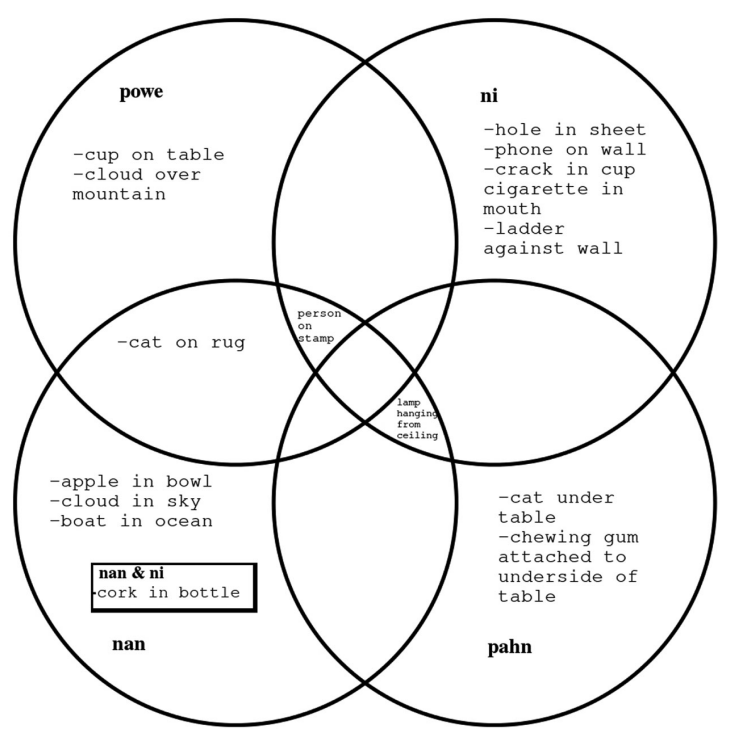

## Important links

- [Article](http://hdl.handle.net/10125/63283)
- [Code and Data](https://github.com/rentzb/topological_relations_pohnpeian)


## Abstract

This article explores a more nuanced understanding of topological relations in the Pohnpeian language (Austronesian). The BowPed Toolkit (Bowerman and Pederson 1992. Topological relations picture series. In Space stimuli kit 1.2: November 1992, 51, Nijmegen: Max Planck Institute for Psycholinguistics. http://fieldmanuals. mpi.nl/volumes/1992/bowped/.) is employed as an elicitation tool with five Pohnpeian speakers. Evolutionary classification tree modeling is used as a discovery tool to find patterns in the data. The results show that the two prepositions in Pohnpeian, nan and ni, should be redefined in terms of topological relations as ‘containment’ and ‘attachment’ respectively. Likewise the meaning of some prepositional nouns are further revised.

## Important figures




## Citation

<p class="buttons" style="text-align:center;">
<a class="btn btn-danger" target="_blank" href="https://www.zotero.org/save?type=doi&q=10.1515/lingvan-2016-0092">&emsp;Add to Zotero </a>
</p>

```bibtex
@article{Rentz-2017,
    title = {Topological Relations in {Pohnpeian}},
    author = {Bradley Rentz},
    journal = {Linguistics Vanguard},
    volume = {3},
    issue = {1},
    pages = {20160092},
    doi = {10.1515/lingvan-2016-0092},
    year = {2017}
  }
```
