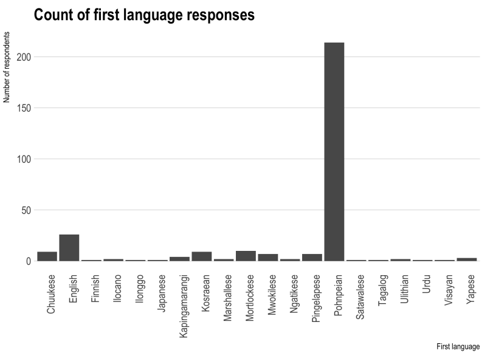
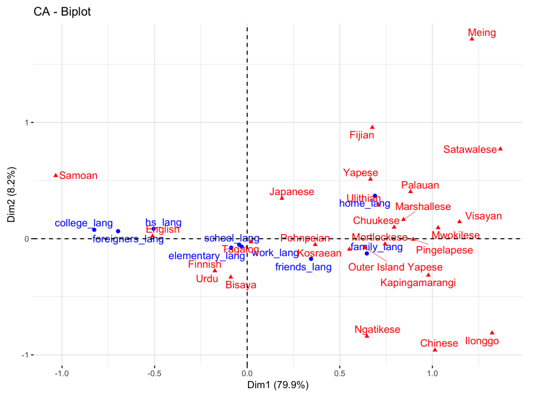
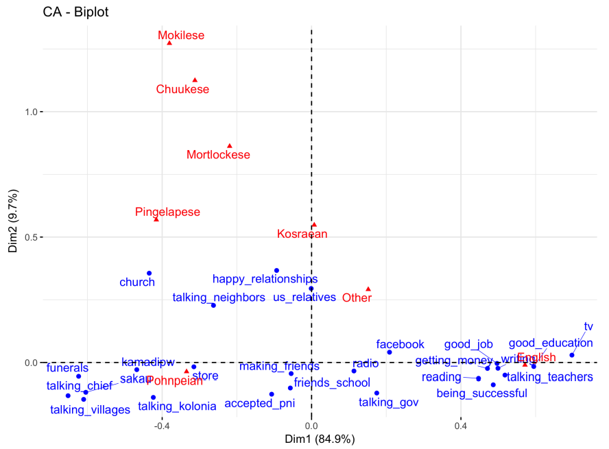
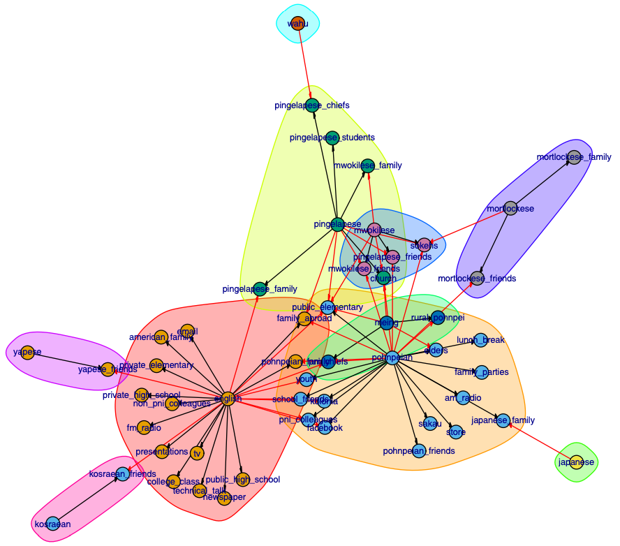
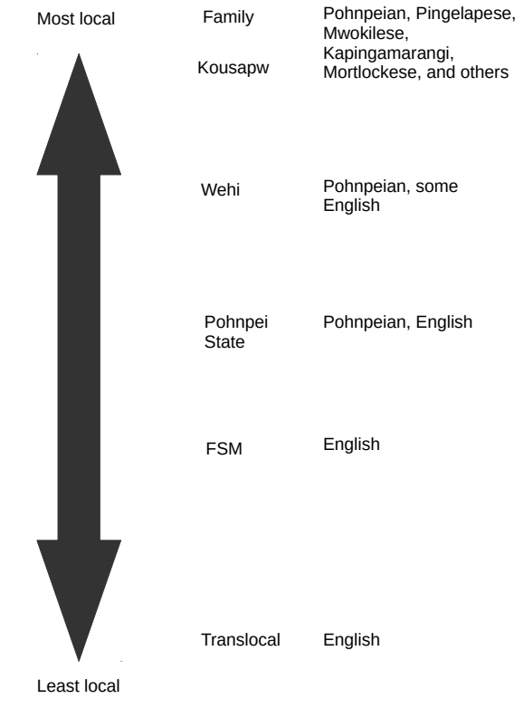

## Important links

- [Full text](http://hdl.handle.net/10125/62508)
- [Code and Data](https://github.com/rentzb/language-attitudes-pohnpei)
- [Partial re-analysis](https://bradleyrentz.com/blog/2025/04/09/pni-languageuse-irt/)


## Abstract

This dissertation provides an analysis of language attitudes of 1.3% of the adult population of the island of Pohnpei in the Federated States of Micronesia. It presents both quantitative survey and qualitative interview data collected July–August 2016 and July–August 2017. The results are situated within a poststructuralist, postcolonial theoretical framework that critically evaluates the colonial history of the island and its ideological effects on language use, as well as highlighting the diversity of opinions found on the island. Because of this framework, the dissertation does not aim to construct a monolithic narrative of language attitudes on Pohnpei, but rather seeks diversity wherever possible. To carry out these goals, the dissertation adapts quantitative methods (multidimensional scaling, cluster analyses, correspondence analysis, and poststratified Bayesian generalized hierarchical modeling) and combines them with critical theoretical tools such as sociolinguistic scale and translanguaging. The results showed two main different ideological groups both in terms of language use and language attitude patterns. Both groups highly value Pohnpeian, English, and other local languages generally. However, the first group values English over Pohnpeian and other local languages. They in general only use Pohnpeian to connect with Pohnpeians and in situations related to the soupeidi system, but use English for most other situations including education, work, media, and government. This group’s language use patterns with scale-based language ideologies, where local levels of scale (such as family and kousapw) are highly multilingual, but become increasingly monolingual as scale increases toward the translocal level. The other group, conversely, finds Pohnpeian to be the most important language for them overall and tend to find Pohnpeian to be the most important language in every domain. The results of the dissertation indicate a disconnect between the current mostly monolingual English-focused educational practices among both private and public schools on Pohnpei and the desire of the research participants for greater use of Pohnpeian and other local languages. The current educational system likewise devalues the symbolic resources of its students, which has perpetuated negative ideologies about local languages. These ideologies adversely affect both the students and the linguistic future of local languages including Pohnpeian.

## Important figures












## Citation

<p class="buttons" style="text-align:center;">
<a class="btn btn-danger" target="_blank" href="https://www.zotero.org/save?type=doi&q=10125/62508">&emsp;Add to Zotero </a>
</p>

```bibtex
@phdthesis{Rentz-2018,
    title = {{Pohnpei sohte ehu [Pohnpei} is not one]: A survey- and interview-based approach to language attitudes on {Pohnpei}},
    author = {Bradley Rentz},
    school = {University of Hawai‘i at Mānoa},
    doi = {10125/62508},
    year = {2018}
  }
```
