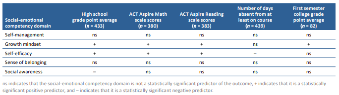

## Important links

- [Main Report](https://files.eric.ed.gov/fulltext/ED613878.pdf)
- [Study Brief (5-pages)](https://files.eric.ed.gov/fulltext/ED613879.pdf)
- [Study Snapshot (1-page)](https://files.eric.ed.gov/fulltext/ED613880.pdf)
- [Study Infographic](https://ies.ed.gov/sites/default/files/migrated/rel/infographics/pdf/REL_PA_Association_Between_High_School_Students_Social_Emotional_Competencies.pdf)
- [Technical Appendices](https://files.eric.ed.gov/fulltext/ED613882.pdf)


## Abstract

This study addressed the need expressed by education stakeholders in the Commonwealth of the Northern Mariana Islands to better understand their high school students’ social-emotional competencies and how those competencies might be associated with students’ academic and behavioral outcomes in high school and college. Social-emotional competencies refer to the knowledge, beliefs, and behaviors that help students recognize and manage their emotions, build positive relationships, and make responsible decisions. In May 2019 grade 11 and 12 students who were enrolled in high schools within the Commonwealth of the Northern Mariana Islands Public School System responded in May 2019 to survey questions regarding their self-management, growth mindset, self-efficacy, sense of belonging, and social awareness using a 5-point scale, with higher scores reflecting greater social-emotional competencies. The study found that high school students and high school students who went on to attend Northern Marianas College scored highest in self-management and lowest in self-efficacy. High school students with higher growth mindset or self-efficacy scores had higher high school grade point averages and grade 10 ACT Aspire math and reading scale scores. Higher self-efficacy scores were also associated with fewer days absent from high school. Students with higher social awareness scores had lower high school grade point
averages. Among the high school students who went on to attend college at Northern Marianas College, higher growth mindset scores were associated with higher first semester college grade point averages, after student characteristics were controlled for. None of the four other social-emotional competency domains was associated with any of the college academic or behavioral outcomes.

## Results summary




## Citation

```bibtex
@techreport{Crowder:2021,
    title = {Associations between High School Students' Social-Emotional Competencies and Their High School and College Academic and Behavioral Outcomes in the {Commonwealth of the Northern Mariana Islands}},
    author = {Marisa K. Crowder and Samantha E. Holquist and Bradley Rentz and Sheila A. Arens},
    url = {https://files.eric.ed.gov/fulltext/ED613878.pdf},
    institution = {U.S. Department of Education, Institute of Education Sciences, National Center for Education Evaluation and Regional Assistance, Regional Educational Laboratory Pacific},
    year = {2021}
  }
```
