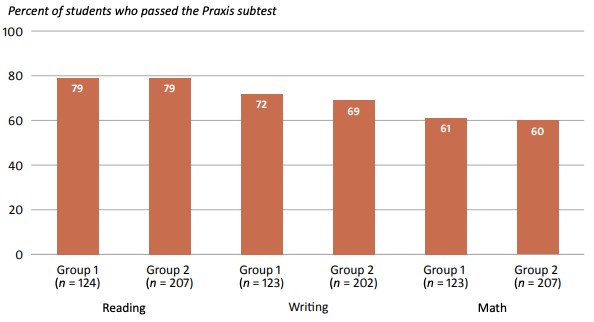
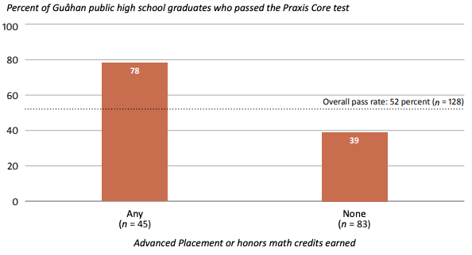
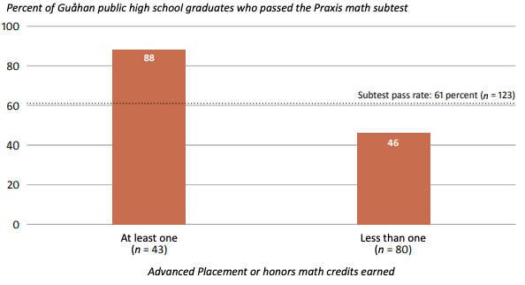

## Important links

- [Main Report](https://files.eric.ed.gov/fulltext/ED613684.pdf)
- [Study Brief (5-pages)](https://files.eric.ed.gov/fulltext/ED613686.pdf)
- [Study Snapshot (1-page)](https://files.eric.ed.gov/fulltext/ED613685.pdf)
- [Study Infographic](https://ies.ed.gov/sites/default/files/migrated/rel/infographics/pdf/REL_PA_Using_High_School_and_College_Data_to_Predict_Teacher_Candidates_Performance_on_the_Praxis_at_the_University_of_Guam.pdf)
- [Technical Appendices](https://files.eric.ed.gov/fulltext/ED613687.pdf)


## Abstract

Policymakers and educators on Guåhan (Guam) are concerned about the persistent shortage of qualified K–12 teachers. Staff at the Unibetsedåt Guåhan (University of Guam, UOG) School of Education, the only local university that offers a teacher training and certification program, believe that more students
are interested in becoming teachers but that the program’s admissions requirements—in particular, the Praxis® Core test, which consists of reading, writing, and math subtests—might be a barrier. Little is known about the predictors for passing the Praxis Core test. This makes it difficult to develop and implement targeted interventions to help students pass the test and prepare for the program. This study examined which student demographic and academic preparation characteristics predict passing the Praxis Core test and each of its subtests. 

The study examined two groups of students who attempted at least one subtest within three years of enrolling at UOG: students who graduated from
a Guåhan public high school (group 1) and all students, regardless of the high school from which they graduated (group 2). Just over half the students in each group passed the Praxis Core test (passed all three subtests) within three years of enrolling at UOG. The pass rate was lower on the math subtest than on the reading and writing subtests. For group 1, students who earned credit for at least one semester of Advanced Placement or honors math courses in high school had a higher pass rate on the Praxis Core test than students who did not earn any credit for those courses, students who earned a grade of 92 percent or higher in grade 10 English had a higher pass rate on the reading subtest than students who
earned a lower grade, and students who earned a grade higher than 103 percent in grade 10 English had a higher pass rate on the writing subtest than students who earned a lower grade. For group 2, students who did not receive a Pell Grant (a proxy for socioeconomic status) had a higher Praxis Core test pass rate than students who did receive a Pell Grant, students who earned a grade of B or higher in first-year college English had a higher Praxis Core test pass rate than students who earned a lower grade, and male students had a higher pass rate on the reading and math subtests than female students.

The study findings have several implications for intervention plans at both the secondary and postsecondary levels. Although students must pass all three Praxis subtests to be admitted to the teacher preparation program at the School of Education, examining student performance on each subtest can help stakeholders understand the content areas in which students might need more support. In the long term preparing more prospective teachers for the Praxis Core test might increase program enrollment, which in turn might increase the on-island hiring pool. 

## Important figures








## Citation

```bibtex
@techreport{Donahue:2021,
    title = {Using High School and College Data to Predict
Teacher Candidates’ Performance on the {Praxis
at Unibetsedåt Guåhan (University of Guam)},
    author = {Tara Donahue and Bradley Rentz and Michelle Santos and Alicia C. Aguon and Sheila A. Arens},
    url = {https://files.eric.ed.gov/fulltext/ED613684.pdf},
    institution = {U.S. Department of Education, Institute of Education Sciences, National Center for Education Evaluation and Regional Assistance, Regional Educational Laboratory Pacific},
    year = {2021}
  }
```
