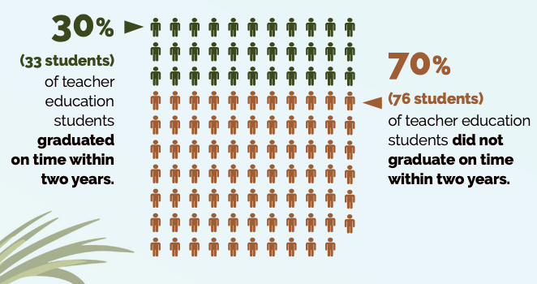
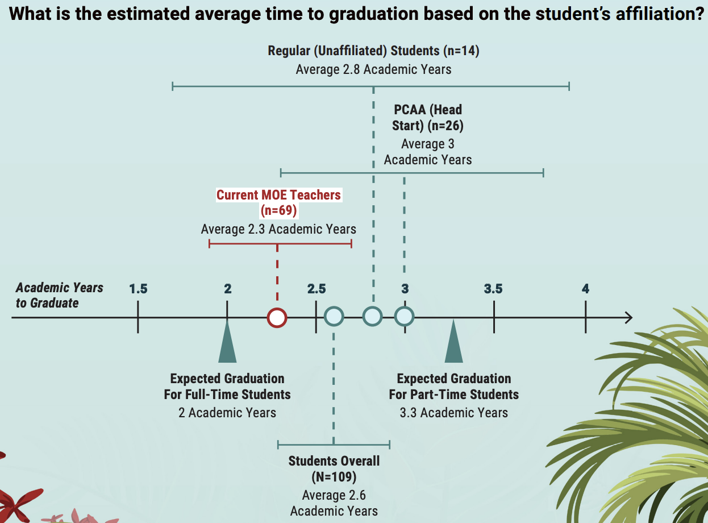

## Important links

- [English Version](https://files.eric.ed.gov/fulltext/ED662063.pdf)
- [Palauan Version](https://files.eric.ed.gov/fulltext/ED662067.pdf)
- [Technical Appendices](http://files.eric.ed.gov/fulltext/ED662068.pdf)


## Abstract

To strengthen teacher preparation in the Republic of Palau, Public Law 10-32 (enacted in 2018) requires all teachers in the country to hold an associate's degree in education or in the subject area they will teach by the end of 2023. This policy change required many current teachers and those interested in the teaching profession to enroll in an associate's degree program at Palau Community College (PCC), the country's only postsecondary institution. To support policymakers' understanding of how long it takes teachers and teacher candidates to meet the requirements of Public Law 10-32, this study examined the graduation patterns of teacher education students enrolled in associate's degree programs at PCC. The aim of this study is to support PCC and the Palau Ministry of Education's efforts to successfully train, retain, and recruit qualified teachers.


## Important figures






## Citation

```bibtex
@techreport{Rentz:2024,
    title = {Teacher Certification, Retention, and Recruitment in {Palau}: Understanding Graduation Patterns of Teacher Education Students at {Palau Community College}},
    author = {Bradley Rentz and Sinton Soalablai and Natasha A. Saelua and Avalloy McCarthy},
    url = {https://eric.ed.gov/?q=palau&id=ED662063},
    institution = {U.S. Department of Education, Institute of Education Sciences, National Center for Education Evaluation and Regional Assistance, Regional Educational Laboratory Pacific},
    year = {2024}
  }
```
