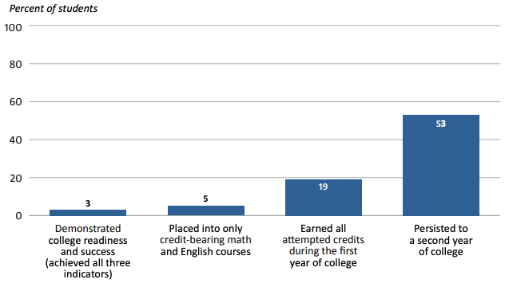
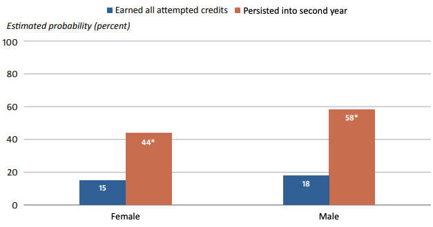

## Important links

- [Main Report](https://files.eric.ed.gov/fulltext/ED611200.pdf)
- [Study Brief (5-pages)](https://files.eric.ed.gov/fulltext/ED611202.pdf)
- [Study Snapshot (1-page)](https://files.eric.ed.gov/fulltext/ED611204.pdf)
- [Study Infographic](https://ies.ed.gov/sites/default/files/migrated/rel/infographics/pdf/REL_PA_Demographic_and_Academic_Characteristics_Associated_with_College_Readiness_and_Early_College_Success_in_the_Republic_of_the_Marshall_Islands.pdf)
- [Technical Appendices](https://files.eric.ed.gov/fulltext/ED611201.pdf)


## Abstract

In the Republic of the Marshall Islands, college readiness and early college success are major concerns. More than 75 percent of a recent cohort of incoming students at the College of the Marshall Islands placed into developmental courses, which suggests that students might not be academically prepared to take
postsecondary coursework. A lack of research on predictors of college readiness and early college success for Marshallese students makes it difficult to develop and implement targeted interventions. This study examined academic preparation characteristics and the college readiness and early college success of students who graduated from Republic of the Marshall Islands public high schools and enrolled at the College of the Marshall Islands between 2015 and 2017. It also examined the relationships between student demographic and preparation characteristics and college readiness and early college success. College
readiness and early college success were defined as achieving all three of the following indicators: placing into only credit-bearing math and English courses, earning all credits attempted during the first year of college, and persisting to a second year of college. About 3 percent of students met all three indicators; 5
percent placed into only credit-bearing math and English courses at the College of the Marshall Islands, 19 percent earned all credits attempted during their first year of college, and 53 percent persisted to a second year of college. Several student characteristics were related to college readiness and early college success. Female students were less likely than male students to persist to a second year of college. Students with a higher cumulative high school grade point average were more likely than other students to earn all credits attempted during their first year of college and to persist to a second year of college. 

## Important figures







## Citation

```bibtex
@techreport{Shannon:2021a,
    title = {Demographic and Academic Characteristics Associated with College Readiness and Early College Success in the {Republic of the Marshall Islands}},
    author = {Lisa Shannon and Anne Cosby and Bradley Rentz and Molly Henschel and Sheila A. Arens  and Marisa Crowder},
    url = {https://files.eric.ed.gov/fulltext/ED611200.pdf},
    institution = {U.S. Department of Education, Institute of Education Sciences, National Center for Education Evaluation and Regional Assistance, Regional Educational Laboratory Pacific},
    year = {2021}
  }
```
