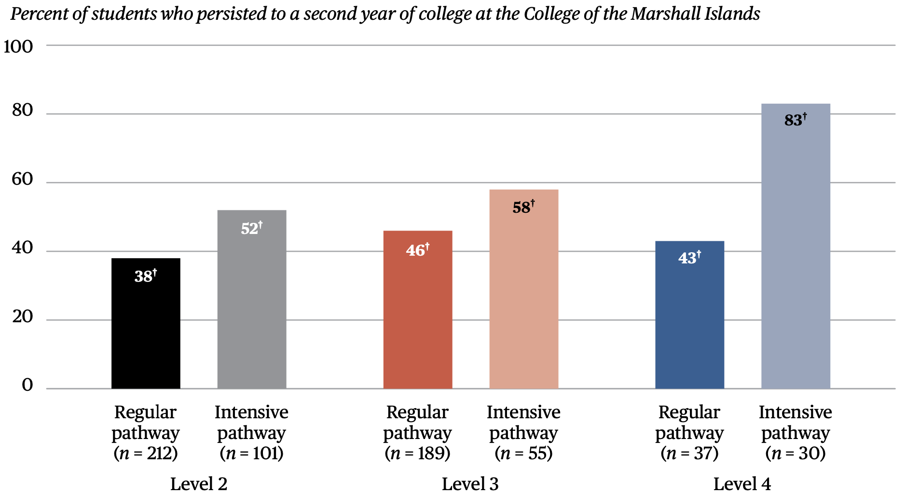

## Abstract

The College of the Marshall Islands (CMI) places many students into developmental English
language arts (ELA) courses, which raises concerns about these students’ likely academic success
and persistence to graduation compared with their peers in credit-bearing courses. In an effort to
increase the percentage of students who place into and pass credit-bearing ELA courses and persist
to a second year of college at CMI, CMI modified its course placement process before the 2021/22
school year. Students now take a revised ELA course placement test that includes multiple-choice and
writing components. Additionally, CMI also considers cumulative high school grade point average
(GPA) when placing students into developmental courses or credit- bearing courses and into regular
or intensive pathways through these courses.

The goals of this study were to evaluate the relationship between the revised ELA course placement
process and student outcomes and examine how well CMI’s revised ELA course placement process
measures ELA course performance. The study examined ELA course placement, course passing,
and college persistence rates among students enrolling at CMI for the first time between spring 2022
and spring 2024, after CMI implemented these changes. The study also evaluated the relationship
between CMI’s revised placement process and performance in credit-bearing ELA courses.
The study found that 11 percent of students who enrolled at CMI between spring 2022 and spring 2024
initially placed into credit-bearing ELA courses. CMI’s prior placement system had a higher credit-bearing placement rate of 22 percent. Students placed into intensive pathways of credit-bearing
courses and higher-level developmental courses in their first year at CMI had the highest passing rates
for credit-bearing courses. Additionally, regardless of course level, students placed into intensive
pathways had the highest rates of college persistence.

The study also found that the multiple- choice component of CMI’s revised ELA course placement test
effectively measured ELA performance, particularly for lower-performing students. The multiple-choice component and high school GPA were similarly able to predict passing credit- bearing ELA
courses, while the writing component did not predict any outcomes. Because of these findings, CMI
might consider using only high school GPA to place students or weighting high school GPA more heavily
and removing the writing component to ensure appropriate and logistically efficient course placement.

## Important figures





## Citation

```bibtex
@techreport{Shannon:2026,
    title = {Examining the {English} Language Arts Course Placement System at the {College of the Marshall Islands},
    author = {Lisa Shannon and Jennifer Gruber and Bradley Rentz and Cheryl Vila and Kristen Erichsen and Jess Nastasi},
    institution = {U.S. Department of Education, Institute of Education Sciences, National Center for Education Evaluation and Regional Assistance, Regional Educational Laboratory Pacific},
    year = {2026},
    url = {https://ies.ed.gov/use-work/resource-library/report/descriptive-study/examining-english-language-arts-course-placement-system-college-marshall-islands}
  }
```
